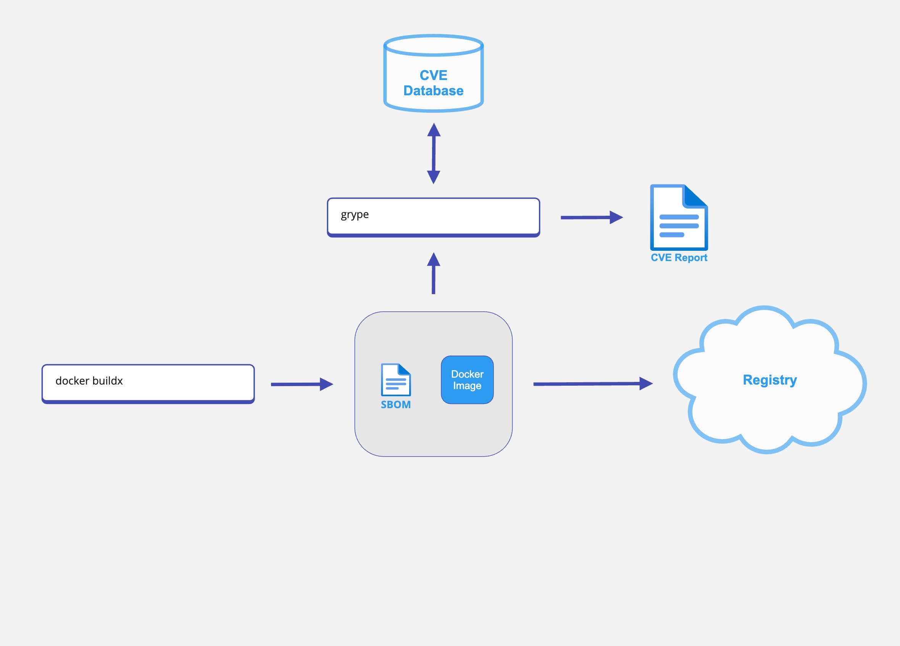

# Using Buildx to generate SBOM and CVE scanning
### This walkthrough is intended for anyone unable to leverage SaaS products for SBOM generation and CVE detection. For everyone else we highly recommend our more comprehensive solution, [Docker Scout](https://scout.docker.com).

## Overview 
SBOM generation, CVE detection, and Policy enforcement are core components of Supply Chain Security. This overview will show you how to incorporate Docker Desktop's [buildx](https://docs.docker.com/engine/reference/commandline/buildx/) command to leverage [BuildKit](https://docs.docker.com/build/buildkit/) SBOM generation and how to consume a generated SBOM, or image with an SBOM, with open-source toolings like [grype](https://hub.docker.com/r/anchore/grype) to detect CVEs and policy violations.



## Generating an SBOM

### Generating an SBOM at Container Build Time

The following command will build the Dockerfile in the current directory and create an out directory with a [SPDX](https://spdx.dev/resources/use/) based JSON file representing your SBOM. It will also generate an attestation that proves the provenance of the image.

```shell
docker buildx build --sbom=true --output type=local,dest=out .
```

Once you've verified your SBOM output locally, you can build, attest, generate an SBOM, and push it to your registry with the following command.

```shell
docker buildx build --tag <namespace>/<image>:<version> --attest type=sbom --push .
```

### Generating an SBOM from an Image
If you need to generate an SBOM from an image that has already been built, you can do so with the following command.

```shell
docker buildx imagetools inspect <namespace>/<image>:<version> --format "{{ json .SBOM.SPDX }}"
```

## Scanning Images for CVEs

You can scan almost any Docker image, but the scan will be even more effective if you build your image with an attestation and SBOM, as shown in [Generating an SBOM at Container Build Time](#generating-an-sbom-at-container-build-time).

Scan an image with the default [grype](https://hub.docker.com/r/anchore/grype) CVE providers.

```shell
docker run -it anchore/grype:latest "-o json <namespace>/<image>:<version>"
```

### Creating a Custom Grype Database for Offline and Proprietary CVE Database Use

* Step 1: Create a custom [vunnel](https://github.com/anchore/vunnel) [provider](https://github.com/anchore/vunnel/tree/main#can-i-implement-a-new-provider) by following the steps outlined in the [Vunnel Example Provider README.md](https://github.com/anchore/vunnel/tree/main/example)

* Step 2: Create a .vunnel.yaml with any overrides

For example (visit https://github.com/anchore/vunnel for more details):
```shell
# .vunnel.yaml
root: ./processed-data

log:
  level: trace

providers:
  <your_provider>:
    request_timeout: 125
    runtime:
      existing_input: keep
      existing_results: delete-before-write
      on_error:
        action: fail
        input: keep
        results: keep
        retry_count: 3
        retry_delay: 10

```
* Step 3: Run vunnel against your newly created provider
```shell
docker run --rm -it -v $(pwd)/data:/data -v $(pwd)/.vunnel.yaml:/.vunnel.yaml ghcr.io/anchore/vunnel:latest run <your provider>
```

* Step 4: Create a [grype-db](https://github.com/anchore/grype-db) [config.yaml](https://github.com/anchore/grype-db#configuration) file 

* Step 5: Run grype-db against your vunnel data output and config
```shell
docker run --rm -it -v $(pwd):/config -w /config ubuntu:latest bash -c "apt-get -y update;apt-get -y install curl;curl -sSfL https://raw.githubusercontent.com/anchore/grype-db/main/install.sh | sh -s -- -b /usr/local/bin; pwd; ls -lh; grype-db -v build""
```

* Step 6: Set the grype `GRYPE_DB_CACHE_DIR` to your grype-db output directory

For example:
```shell
export GRYPE_DB_CACHE_DIR=/data
```

## Citations and Helpful Information
* [Build Attestations and SBOMs](https://docs.docker.com/build/attestations/)
* [BuildKit and buildx](https://docs.docker.com/build/buildkit/)
* [Grype](https://github.com/anchore/grype)
* [Grype-db](https://github.com/anchore/grype-db)
* [SPDX](https://spdx.dev/resources/use/)
* [Vunnel](https://github.com/anchore/vunnel)


