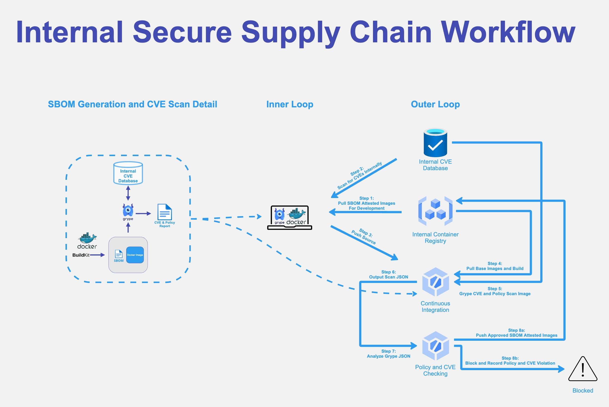

# Using Buildx to generate SBOM and CVE scanning
### This walkthrough is intended for anyone unable to leverage SaaS products for SBOM generation and CVE detection. For everyone else we highly recommend our more comprehensive solution, [Docker Scout](https://scout.docker.com).

## Overview 
SBOM generation, CVE detection, and Policy enforcement are core components of Supply Chain Security. This overview will show you how to incorporate Docker Desktop's [buildx](https://docs.docker.com/engine/reference/commandline/buildx/) command to leverage [BuildKit](https://docs.docker.com/build/buildkit/) SBOM generation and how to consume a generated SBOM, or image with an SBOM, with open-source toolings like [grype](https://hub.docker.com/r/anchore/grype) to detect CVEs and policy violations.



## Generating an SBOM

### Generating an SBOM at Container Build Time

The following command will build the Dockerfile in the current directory and create an out directory with a [SPDX](https://spdx.dev/resources/use/) based JSON file representing your SBOM. It will also generate an attestation that proves the provenance of the image.

```shell
docker buildx build --sbom=true --output type=local,dest=out .
```

Once you've verified your SBOM output locally, you can build, attest, generate an SBOM, and push it to your registry with the following command.

```shell
docker buildx build --tag <namespace>/<image>:<version> --attest type=sbom --push .
```

### Generating an SBOM from an Image
If you need to generate an SBOM from an image that has already been built, you can do so with the following command.

```shell
docker buildx imagetools inspect <namespace>/<image>:<version> --format "{{ json .SBOM.SPDX }}"
```

## Scanning Images for CVEs

You can scan almost any Docker image, but the scan will be even more effective if you build your image with an attestation and SBOM, as shown in [Generating an SBOM at Container Build Time](#generating-an-sbom-at-container-build-time).

### Using a Docker Image with the Default Database

Scan an image with the default [grype](https://hub.docker.com/r/anchore/grype) CVE providers.

```shell
docker run -it anchore/grype:latest "<namespace>/<image>:<version>" "-o json"
```
### Creating a Grype Database for Offline / Airgapped Use Manually

* Step 1: Install [grype](https://github.com/anchore/grype).

**Macintosh**
```shell
$ brew install grype
```

**Linux / Windows (WSL2)**
```shell
$ curl -sSfL https://raw.githubusercontent.com/anchore/grype/main/install.sh | sh -s -- -b /usr/local/bin
 ```

* Step 2: Install [grype-db](https://github.com/anchore/grype-db)
```shell
$ curl -sSfL https://raw.githubusercontent.com/anchore/grype-db/main/install.sh | sh -s -- -b /usr/local/bin
 ```
* Step 3: Determine which providers you want to use; Grype leverages Vunnel to build a provider list; the following
command lists all available providers.
```shell
$ grype-db -g list-providers
[0000]  INFO grype-db version: 0.19.1
nvd
alpine
amazon
chainguard
debian
github
mariner
oracle
rhel
sles
ubuntu
wolfi
```
* Step 4: For test purposes, we will use the `alpine` CVE database. This step downloads the data from the provider.
```shell
$ grype-db -g -p alpine
[0000]  INFO grype-db version: 0.19.1
[0001]  INFO aggregating vulnerability data providers=[alpine]
[0001]  INFO running vulnerability provider provider=alpine
[0001]  INFO alpine: WARNING: The requested images platform (linux/amd64) does not match the detected host platform (linux/arm64/v8) and no specific platform was requested
[0002]  INFO alpine: running alpine provider
[0002]  INFO alpine: downloading alpine secdb metadata from: https://secdb.alpinelinux.org
[0003]  INFO alpine: Downloading secdb edge main
[0004]  INFO alpine: Downloading secdb edge community
[0005]  INFO alpine: Downloading secdb v3.10 main
[0006]  INFO alpine: Downloading secdb v3.10 community
[0007]  INFO alpine: Downloading secdb v3.11 main
[0007]  INFO alpine: Downloading secdb v3.11 community
[0008]  INFO alpine: Downloading secdb v3.12 main
[0009]  INFO alpine: Downloading secdb v3.12 community
[0010]  INFO alpine: Downloading secdb v3.13 main
<-- SNIP -->
[0032]  INFO alpine: processing edge:main
[0032]  INFO alpine: processing edge:community
[0050]  INFO alpine: processing 3.10:main
[0050]  INFO alpine: processing 3.10:community
[0057]  INFO alpine: processing 3.11:main
[0057]  INFO alpine: processing 3.11:community
[0066]  INFO alpine: processing 3.12:main
[0066]  INFO alpine: processing 3.12:community
[0076]  INFO alpine: processing 3.13:main
<-- SNIP -->
[0196]  INFO alpine: wrote 51176 entries
[0196]  INFO alpine: recording workspace state
[0198]  INFO building database build-directory=./build providers=[alpine] schema=5
[0207]  INFO database created path=build/vulnerability.db
[0207]  INFO packaging database extension-override= from=./build url=https://localhost:8080/grype/databases
[0207]  INFO created database archive path=build/vulnerability-db_v5_2023-09-14T20:10:52Z_a6b59b1c4a10eb1aa637.tar.gz 
```

* Step 5: This step will take the data downloaded above and build it into the SQLite format used by grype.
```shell
$ grype-db -g -p alpine build
[0000]  INFO grype-db version: 0.19.1
[0001]  INFO building database build-directory=./build providers=[alpine] schema=5
[0010]  INFO database created path=build/vulnerability.db

$ ls -alt build
total 54184
-rw-------@ 1 jschmidt  staff       139 Sep 14 14:27 metadata.json
-rw-r--r--@ 1 jschmidt  staff  25120768 Sep 14 14:27 vulnerability.db
drwxr-xr-x@ 6 jschmidt  staff       192 Sep 14 14:27 .
-rw-------@ 1 jschmidt  staff       312 Sep 14 14:14 listing.json
-rw-r--r--@ 1 jschmidt  staff   2610866 Sep 14 14:14 vulnerability-db_v5_2023-09-14T20:10:52Z_a6b59b1c4a10eb1aa637.tar.gz
drwxr-xr-x@ 4 jschmidt  staff       128 Sep 14 14:08 ..
```
* Step 6: Setup the [.grype.yaml](./configs/grype.yaml) configuration; note that we are disabling the auto-update and 
the location of the cache in order to more fine tune our usage.

* Step 7: Import the new database; note that the name of your database will not match. Using the default configuration, 
the databases will all contain the `tar.gz` extension, so a glob can be used here.

```shell
$ grype db import ./build/vulnerability-db_v5_2023-09-14T20:10:52Z_a6b59b1c4a10eb1aa637.tar.gz
Vulnerability database imported
```
* Step 8: Validate that the database has been imported; the build time will match the time you build the database in
Step 5 above.
```shell
$ grype db status
Location:  grype/db/5
Built:     2023-09-14 20:10:52 +0000 UTC
Schema:    5
Checksum:  sha256:7e7d3b6253c11a4bb10c4896e7cee895984ca2993fdd7fc907e4fb077d4d6a20
Status:    valid
```
* Step 9: At this point you can use your grype installation normally; the configuration put in place in Step 6 above
will instruct the tool to use the newly created database.
```shell
$ grype felipecruz/alpine-tar-zstd
	✔ Vulnerability DB                [no update available]
	✔ Loaded image                    felipecruz/alpine-tar-zstd:latest
	✔ Parsed image                    sha256:055e5a7f538aa05921c66438029351d385aa66b97b26ffb8cfd89fb920a5c958
	✔ Cataloged packages              [20 packages]
	✔ Scanned for vulnerabilities     [19 vulnerabilities]
  	├── 0 critical, 0 high, 0 medium, 0 low, 0 negligible (19 unknown)
  	└── 19 fixed
NAME          INSTALLED  FIXED-IN   TYPE  VULNERABILITY   SEVERITY
libcrypto1.1  1.1.1q-r0  1.1.1v-r0  apk   CVE-2023-3817   Unknown
libcrypto1.1  1.1.1q-r0  1.1.1u-r2  apk   CVE-2023-3446   Unknown
libcrypto1.1  1.1.1q-r0  1.1.1u-r0  apk   CVE-2023-2650   Unknown
libcrypto1.1  1.1.1q-r0  1.1.1t-r2  apk   CVE-2023-0465   Unknown
libcrypto1.1  1.1.1q-r0  1.1.1t-r1  apk   CVE-2023-0464   Unknown
libcrypto1.1  1.1.1q-r0  1.1.1t-r0  apk   CVE-2023-0286   Unknown
libcrypto1.1  1.1.1q-r0  1.1.1t-r0  apk   CVE-2023-0215   Unknown
libcrypto1.1  1.1.1q-r0  1.1.1t-r0  apk   CVE-2022-4450   Unknown
libcrypto1.1  1.1.1q-r0  1.1.1t-r0  apk   CVE-2022-4304   Unknown
libssl1.1     1.1.1q-r0  1.1.1v-r0  apk   CVE-2023-3817   Unknown
libssl1.1     1.1.1q-r0  1.1.1u-r2  apk   CVE-2023-3446   Unknown
libssl1.1     1.1.1q-r0  1.1.1u-r0  apk   CVE-2023-2650   Unknown
libssl1.1     1.1.1q-r0  1.1.1t-r2  apk   CVE-2023-0465   Unknown
libssl1.1     1.1.1q-r0  1.1.1t-r1  apk   CVE-2023-0464   Unknown
libssl1.1     1.1.1q-r0  1.1.1t-r0  apk   CVE-2023-0286   Unknown
libssl1.1     1.1.1q-r0  1.1.1t-r0  apk   CVE-2023-0215   Unknown
libssl1.1     1.1.1q-r0  1.1.1t-r0  apk   CVE-2022-4450   Unknown
libssl1.1     1.1.1q-r0  1.1.1t-r0  apk   CVE-2022-4304   Unknown
tar           1.34-r0    1.34-r1    apk   CVE-2022-48303  Unknown
```

### Creating a Grype Database Docker Image for Offline / Airgapped Use
Please see the [Grype Database Image Build](../../Tools/GrypeDatabaseImageBuild/README.md) document in the 
[Tools](../../Tools) directory for a working example.

### Creating a Custom Grype Database for Proprietary CVE Database Use
In order to do this, you will need to create a custom [vunnel](https://github.com/anchore/vunnel)
[provider](https://github.com/anchore/vunnel/tree/main#can-i-implement-a-new-provider) and build a custom binary.

* Step 1: Fork the https://github.com/anchore/vunnel repository and clone it to work on it locally.
* Step 2: Follow the steps outlined in the [Vunnel Example Provider README.md](https://github.com/anchore/vunnel/tree/main/example) to build and test your provider.
* Step 3: Install the new `grype` binary.
* Step 3: Follow either the manual or the docker-based steps above to build an offline database for testing. 
  * You will need to create .vunnel.yaml with any overrides (visit https://github.com/anchore/vunnel for more details)
  * If you are building the Docker image ensure you are loading the newly compiled binary.

## Citations and Helpful Information
* [Build Attestations and SBOMs](https://docs.docker.com/build/attestations/)
* [BuildKit and buildx](https://docs.docker.com/build/buildkit/)
* [Grype](https://github.com/anchore/grype)
* [Grype-db](https://github.com/anchore/grype-db)
* [SPDX](https://spdx.dev/resources/use/)
* [Vunnel](https://github.com/anchore/vunnel)
* [Vunnel Example Provider README.md](https://github.com/anchore/vunnel/tree/main/example) 


