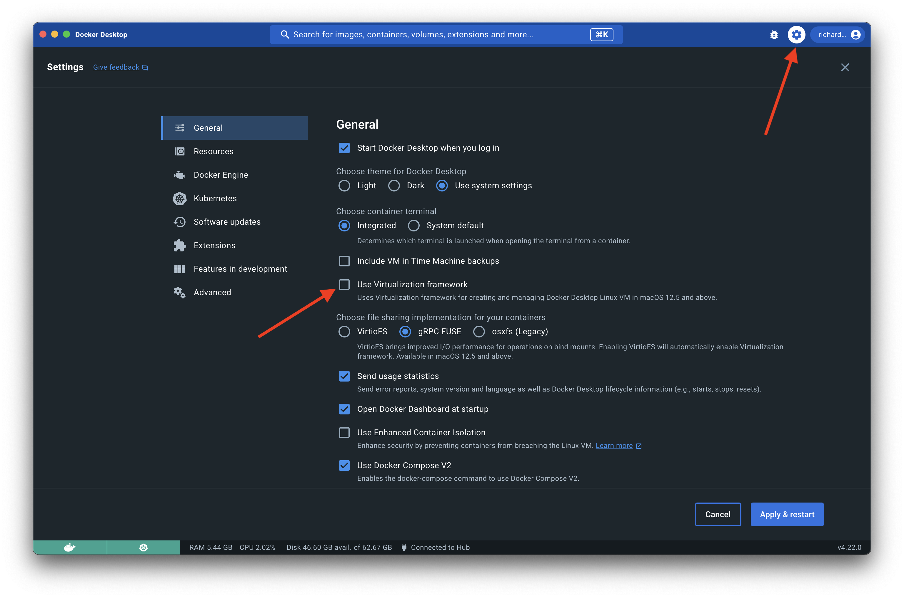

# enable-macos-virtualization-framework
How-To Enable virtualization.framework on macOS hosts

Docker Desktop on macOS is configured by default to use macOS's [hypervisor.framework](https://developer.apple.com/documentation/hypervisor) as the virtualization technology used with Docker Desktop Containers. A peformance gain can be achieved by utilizing macOS's [virtualization.framework](https://developer.apple.com/documentation/virtualization) which is an optional setting in Docker Desktop.

There are two ways to enable [virtualization.framework](https://developer.apple.com/documentation/virtualization), one is more suitable to one-off configuration and the other is more suitable for mass deployment with the tooling of your choice.

# Option 1: Configuration with Docker Desktop UI

1. Navigate to the Settings menu in Docker Desktop and click on `General`

2. Click the box next to `Use Virtualization framework` and then click on `Apply & restart`

3. Docker Desktop is now using macOS's [virtualization.framework](https://developer.apple.com/documentation/virtualization)

# Option 2: Configuration by distributing a custom settings.json

1. Start with a baseline `settings.json`,:
    1a. If you don't have a baseline `settings.json` you can start with [this example](./settings.json)

2. Edit your settings.json and change `"useVirtualizationFramework":false,` to `"useVirtualizationFramework:true,`.

3. Use the tooling of your choice to distribute the settings.json file to each machine at the following path: `$HOME/Library/Group\ Containers/group.com.docker/settings.json`

4. Restart Docker Desktop. 

### Citations and helpful links
* [Change Docker Desktop Settings on Mac](https://docs.docker.com/desktop/settings/mac/)
* [The Magic behind the scenes of Docker Desktop](https://www.docker.com/blog/the-magic-behind-the-scenes-of-docker-desktop/)