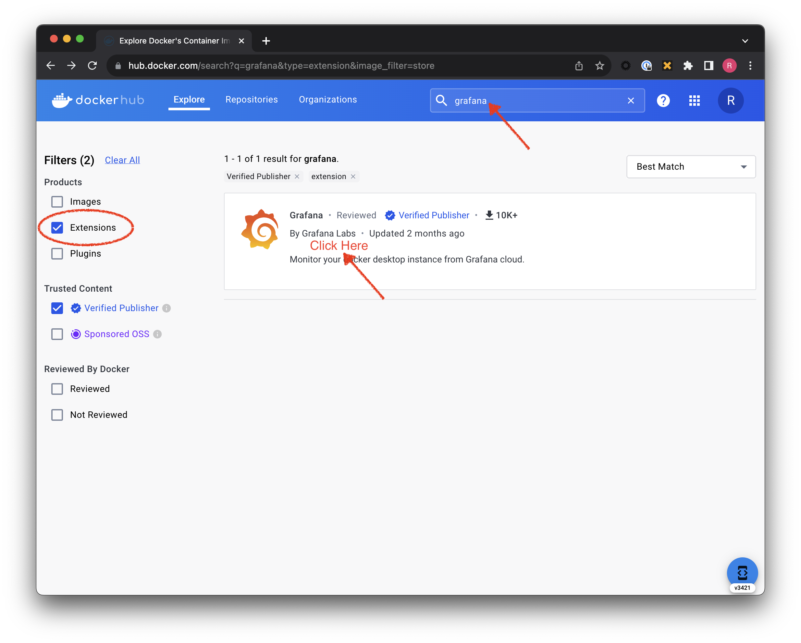
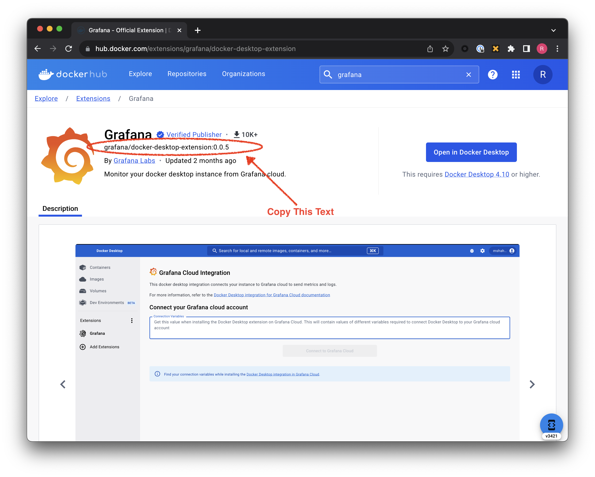

# Importing and Installing Extensions to and from an On-Prem Registry

## Overview
This walkthrough demonstrates how Docker Extensions can be imported and managed in an on-prem or privately controlled registry such as JFrog Artifactory.

## Step 1: Find the Extension
### Step 1a: Search 


### Step 1b: Copy the Extension's Name and Tag string


## Step 2: Pull the Extension locally using the string copied above
```bash
$ docker pull grafana/docker-desktop-extension:0.0.5
```
## Step 3: Tag the local Extension
```bash
$ docker tag grafana/docker-desktop-extension:0.0.5 <your-on-prem-registry>/grafana/docker-desktop-extension:0.0.5
```

## Step 4: Push the Tagged local Extension to your On-Prem Registry
```bash
$ docker push <your-on-prem-registry>/grafana/docker-desktop-extension:0.0.5
```

## Step 5: Install the Extension from your On-Prem Registry
```bash
$ docker extension install <your-on-prem-registry>/grafana/docker-desktop-extension:0.0.5
```
