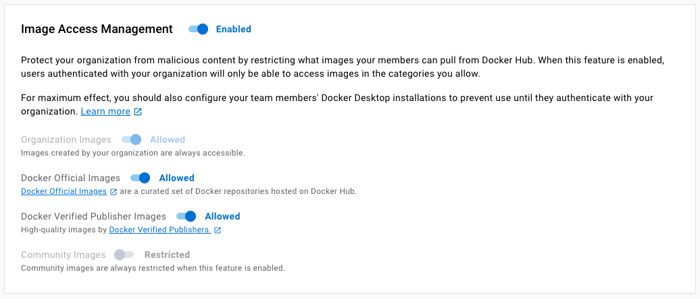
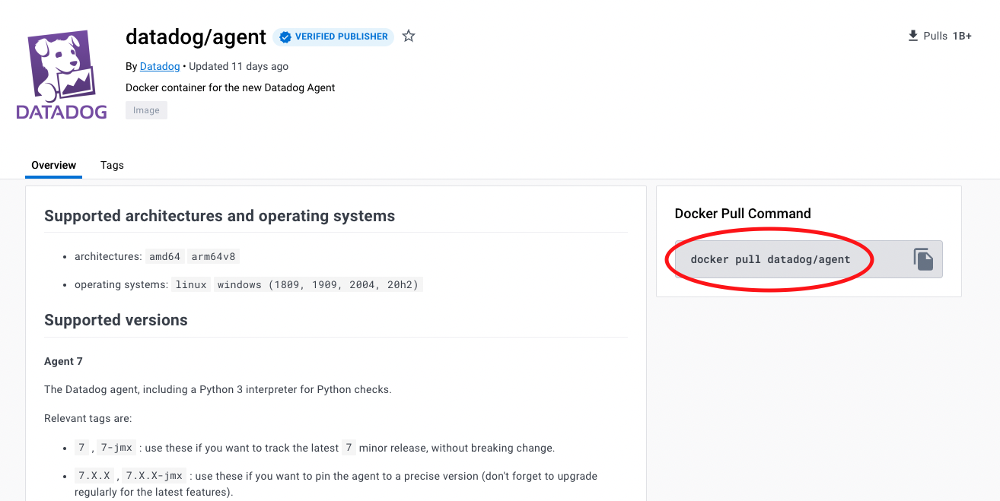
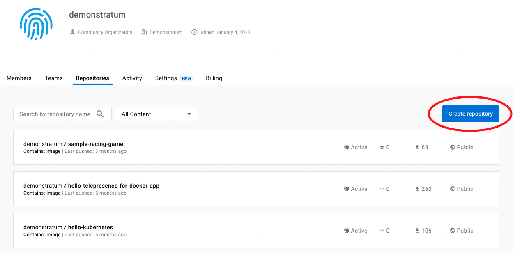
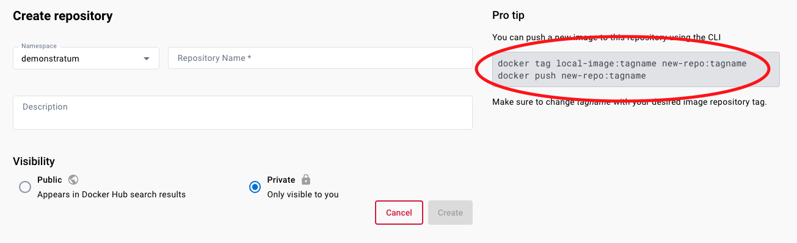
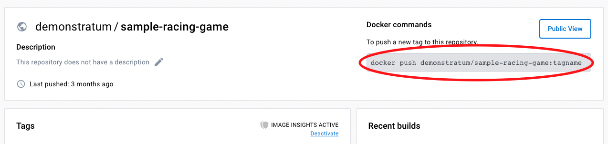

# Granting Access to Specific Community Images in Your Docker Hub Organization
A guide for leveraging Image Access Management and team-based permission controls to allow user access to approved repositories.

## The Problem:
[Image Access Management](https://docs.docker.com/docker-hub/image-access-management/) is a feature that empowers Docker Hub organization administrators (Owners) to allow or disallow access to images stored on Docker Hub at a category level. These categories include the following:
  * Organization Images: images that have been pushed to a repository in your organization. These images can either be Public or Private. Access to these images is controlled by Owners and Editors at the team level.
  * Docker Official Images (DOI): a curated set of Docker repositories hosted on Docker Hub.
  * Docker Verified Publisher (DVP) Images: images published by our partners (DVPs) that are part of the Verified Publisher program and are qualified to be included in the developer secure supply chain.
  * Community Images: any images that do not fall into one of the previous 3 categories. These images are not considered to be "trusted" because various Docker Hub users contribute to them and they may pose security risks.

It is important to note that when Image Access Management is enabled, access to Organization Images is enabled by default and cannot be changed. Similarly, access to Community Images is disabled and cannot be changed.

One limitation of Image Access Management is the lack of a more granular control around access to specific images. With Organization Images, this level of control can be achieved through [team-based permissions](https://docs.docker.com/docker-hub/manage-a-team/#configure-repository-permissions-for-a-team). However, there is no way to leverage Image Access Management to programmatically allow access to particular Community Images but disallow access to the rest. This can create difficulties for organizations who choose to use and have vetted specific Community Images but do not want to open up the entire category of Community Images to their developers.

## The Workaround Solution

Although Docker Hub does not yet provide a way to grant access to a particular set of Community Images, we recommend a workaround solution to satisfy most requirements. This will involve enabling Image Access Management, designating an organization Owner to pull the needed Community Images, creating repositories in the organization (one for each image needed), then pushing the images to their respective repositories.

This can be broken down step-by-step in more detail:
  1. **Enable Image Access Management in Docker Hub.** You may choose whether to enable or disable access to Docker Official Images and DVP Images (the other two categories are locked and cannot be changed, as detailed above).
     
  2. **Designate an Owner to pull the approved Community Images.** When Image Access Management is enabled, and access to Community Images is restricted by default, Owners can override this setting. Thus, an Owner can pull from any source to their local machine. You can find the specific command for pulling an image on the repository's homepage in Docker Hub.

  3. **Designate an Owner or Editor in the organization to create the repositories needed to house the images.** An Editor has similar capabilities to a Member, except they may also create, edit, and delete repositories. More information on the types of roles in an organization can be found [here](https://docs.docker.com/docker-hub/roles-and-permissions/).
     
  4. **Create the repositories.** This can be done by navigating to the **Repositories** tab in the organization, and selecting "Create Repository." On the Create Repository page, you must select a name for the repository along with an optional description. You must then specify whether you'd like to make the repository Public or Private. Public repositories can be pulled by any Docker user, but cannot be pushed to by any user who has not explicitly been given access. Private repositories are only accessible to the repository creator and organization Owners by default, but access can be managed by assigning permissions to teams within the organization. No user outside the organization may pull from or push to these Private repositories. You can find more details about assigning team permissions to repositories [here](https://docs.docker.com/docker-hub/manage-a-team/#configure-repository-permissions-for-a-team).

  5. **Push the images to the organization repositories you created.** This can be done from Docker Desktop by [tagging and pushing the images](https://docs.docker.com/docker-hub/repos/create/#push-a-docker-container-image-to-docker-hub) to the specified repositories. You can also find steps for tagging and pushing these images to a specific repository on that reposiotry's Creation Page as well as its Homepage once it has been created.

At this stage, the Community Images have been migrated into the organization and can be accessed by organization members at Owners' discretion.

## Limitation
The limitation to this approach involves repeated processes each time the Community Images are updated in Docker Hub. Since the end users are not able to pull directly from the image source, Owners must track updates and repeat the steps to pull and push the images. Docker is working to automate this process through administrative enhancements to our [Docker Hub API](https://docs.docker.com/docker-hub/api/latest/); however, the process of tracking new versions of images remains manual at this time.