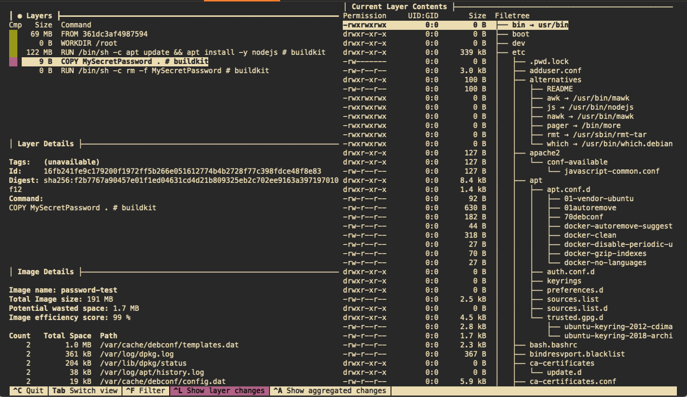

# Deep Dive into Images - Whiteout 
### This walkthrough shows what really happens when you delete a file in a child layer of an image

## Overview 
As part of any Docker image best practices we are told to avoid putting secrets into images. Why is this?

The simple answer is "once written, an image layer is immutable"; the longer answer requires that we understand 
what a union filesystem is. This is also why you should always delete unneeded files - caches, temporary files, etc -
in the same layer they are created in, otherwise they still occupy space in the final image (although you will no 
longer see them if you delete them in a child image).

### Union Filesystems
Simply put, a union filesystem creates a cohesive view of a filesystem that is physically composed of several different
groups of files (layers, branches, directories, etc). The driver is responsible for presenting the filesystem to the
system and handles all of the mechanics of presenting the merged view.

The mostly commonly used filesystem in Docker currently is the 
[OverlayFS](https://github.com/torvalds/linux/tree/master/fs/overlayfs), which is what we will be using for this 
example.

## The Problem; Deleted Files...are not Deleted
Remember the good old days of reaching for that little bottle of whiteout to cover up a mistake on paper? 
Docker's OverlayFS operates on a similar principle, but in the digital realm. Just like how whiteout conceals the error
beneath a white layer, allowing for the possibility to reveal it again by scraping it off, OverlayFS works by layering 
directories - a lower one that is read-only and an upper one that is read-write. When Docker pulls an image, it fetches 
a series of read-only layers (the original text, if you will) and stacks them neatly one on top of the other. Now, when 
you run a container and make changes (or mistakes), these alterations occur in a top, writeable layer, essentially 
using digital "whiteout" to mask the elements in the layers below without altering them. This means, much like peeling 
back dried whiteout, you can still access the original details in the lower layers if needed. 

Although this is efficient from a technical and organizational standpoint, it does have the side effect allowing access 
to a file you don't really want people to have access to. Worse, many people do not fully understand how the OverlayFS 
works so they are blissfully unaware of their potential exposure.

### How Tough is it to Get the File Back?
Not really tough at all; remember that a docker image is built from a number of layers. So it's just a matter of 
finding the layer where the file you want to recover was created and pulling it from there.

### Example?
Sure, let's go through a quick example using a small image with a handful of layers.

#### Dockerfile
This is a simple dockerfile that pulls the latest Ubuntu image, sets the work location to `/root`, does an update, 
and copies over a secret password. Then it deletes the password.

```dockerfile
FROM ubuntu
WORKDIR /root
RUN apt update && apt install -y nodejs
COPY MySecretPassword .
RUN rm -f MySecretPassword
```

```shell
$ cat MySecretPassword
Password
```

#### Build The Image
Build the image.

```shell
$ docker buildx build --no-cache -t password-test .

[+] Building 10.0s (10/10) FINISHED                                                                                                  docker:desktop-linux
 => [internal] load build definition from Dockerfile                                                                                                 0.0s
 => => transferring dockerfile: 192B                                                                                                                 0.0s
 => [internal] load .dockerignore                                                                                                                    0.0s
 => => transferring context: 2B                                                                                                                      0.0s
 => [internal] load metadata for docker.io/library/ubuntu:latest                                                                                     0.0s
 => [1/5] FROM docker.io/library/ubuntu                                                                                                              0.0s
 => [internal] load build context                                                                                                                    0.0s
 => => transferring context: 74B                                                                                                                     0.0s
 => CACHED [2/5] WORKDIR /root                                                                                                                       0.0s
 => [3/5] RUN apt update && apt install -y nodejs                                                                                                    9.5s
 => [4/5] COPY MySecretPassword .                                                                                                                    0.0s
 => [5/5] RUN rm -f MySecretPassword                                                                                                                 0.2s
 => exporting to image                                                                                                                               0.2s
 => => exporting layers                                                                                                                              0.2s
 => => writing image sha256:95d8ed919c72b400e96ba2765797e12ae76cef6094f2b34b1d69a1a9be247bac                                                         0.0s
 => => naming to docker.io/library/password-test                                                                                                     0.0s

View build details: docker-desktop://dashboard/build/desktop-linux/desktop-linux/0rs3c1htzxrti3znimng1fmn6
```

#### Inspect the Image
Let's use the [`docker inspect`](https://docs.docker.com/engine/reference/commandline/inspect/)
command to view the contents of our image; note that I am using a 
[`jq`](https://jqlang.github.io/jq/) filter to cut down the JSON being returned to just the part we 
are concerned with. This shows us the actual files on the disk of the 
system running the docker daaemon.

```shell
$ docker inspect password-test| jq '.[].GraphDriver'
{
  "Data": {
    "LowerDir": "/var/lib/docker/overlay2/6fi0uii6ovnuhv9ovglexzb23/diff:/var/lib/docker/overlay2/p5rypolie52umbkz04kncs6df/diff:/var/lib/docker/overlay2/lyumsz8gbj7aoouiuevmfejwc/diff:/var/lib/docker/overlay2/d38a1c7759c268c8bce5e7c2c7bf4386d94e2a803f93d89e659245c3c6ba8081/diff",
    "MergedDir": "/var/lib/docker/overlay2/uvuy1xoz7vomuvdzlzrgpu25v/merged",
    "UpperDir": "/var/lib/docker/overlay2/uvuy1xoz7vomuvdzlzrgpu25v/diff",
    "WorkDir": "/var/lib/docker/overlay2/uvuy1xoz7vomuvdzlzrgpu25v/work"
  },
  "Name": "overlay2"
}
```

### Using `dive`
There is an OSS tool named [`dive`](https://github.com/wagoodman/dive) that can be used to interactively drill into an 
image to see the layers, what file changes they have, etc.

```shell
$ dive custom-node
Image Source: docker://custom-node
Fetching image... (this can take a while for large images)
Analyzing image...
Building cache...
```


Dive is a curses-based program that can be run from your terminal; in the example below I've selected the layer that we 
are interested in - the COPY instruction - and can look under the "Layer Details" section to see the Id for that layer.



#### Backing up the Image
Now we are going to make use of the [`docker save`](https://docs.docker.com/engine/reference/commandline/save/)
command to export our image to a tar file
```Shell
$ docker save password-test -o password-test.tgz
```

#### Structure of a Docker Save File
This file is essentially a collection of tar files in a tar file:

```shell
$ tar tvf password-test.tgz
drwxr-xr-x  0 0      0           0 Sep 19 16:40 15ebf9d8659ff5f2acd0d69fc5f0f442ac807e275c3f310e4f52f19a03630c05/
-rw-r--r--  0 0      0           3 Sep 19 16:40 15ebf9d8659ff5f2acd0d69fc5f0f442ac807e275c3f310e4f52f19a03630c05/VERSION
-rw-r--r--  0 0      0         961 Sep 19 16:40 15ebf9d8659ff5f2acd0d69fc5f0f442ac807e275c3f310e4f52f19a03630c05/json
-rw-r--r--  0 0      0        2048 Sep 19 16:40 15ebf9d8659ff5f2acd0d69fc5f0f442ac807e275c3f310e4f52f19a03630c05/layer.tar
drwxr-xr-x  0 0      0           0 Sep 19 16:40 16fb241fe9c179200f1972ff5b266e051612774b4b2728f77c398fdce48f8e83/
-rw-r--r--  0 0      0           3 Sep 19 16:40 16fb241fe9c179200f1972ff5b266e051612774b4b2728f77c398fdce48f8e83/VERSION
-rw-r--r--  0 0      0         477 Sep 19 16:40 16fb241fe9c179200f1972ff5b266e051612774b4b2728f77c398fdce48f8e83/json
-rw-r--r--  0 0      0        2560 Sep 19 16:40 16fb241fe9c179200f1972ff5b266e051612774b4b2728f77c398fdce48f8e83/layer.tar
drwxr-xr-x  0 0      0           0 Sep 19 16:40 361dc3af49875947c1dcf5fad95443a56342ee02420a426fecb772c87e16543c/
-rw-r--r--  0 0      0           3 Sep 19 16:40 361dc3af49875947c1dcf5fad95443a56342ee02420a426fecb772c87e16543c/VERSION
-rw-r--r--  0 0      0         401 Sep 19 16:40 361dc3af49875947c1dcf5fad95443a56342ee02420a426fecb772c87e16543c/json
-rw-r--r--  0 0      0    71789568 Sep 19 16:40 361dc3af49875947c1dcf5fad95443a56342ee02420a426fecb772c87e16543c/layer.tar
drwxr-xr-x  0 0      0           0 Sep 19 16:40 4e8ff56746dd77d6e87a7f7492191e83d63af112641b8b1440023a62ff7f8e2f/
-rw-r--r--  0 0      0           3 Sep 19 16:40 4e8ff56746dd77d6e87a7f7492191e83d63af112641b8b1440023a62ff7f8e2f/VERSION
-rw-r--r--  0 0      0         477 Sep 19 16:40 4e8ff56746dd77d6e87a7f7492191e83d63af112641b8b1440023a62ff7f8e2f/json
-rw-r--r--  0 0      0   122014720 Sep 19 16:40 4e8ff56746dd77d6e87a7f7492191e83d63af112641b8b1440023a62ff7f8e2f/layer.tar
-rw-r--r--  0 0      0        2104 Sep 19 16:40 95d8ed919c72b400e96ba2765797e12ae76cef6094f2b34b1d69a1a9be247bac.json
drwxr-xr-x  0 0      0           0 Sep 19 16:40 e5a36d195da482a537e21af130bf4890830ddea0f8c83aa159c39fb99f17d977/
-rw-r--r--  0 0      0           3 Sep 19 16:40 e5a36d195da482a537e21af130bf4890830ddea0f8c83aa159c39fb99f17d977/VERSION
-rw-r--r--  0 0      0         477 Sep 19 16:40 e5a36d195da482a537e21af130bf4890830ddea0f8c83aa159c39fb99f17d977/json
-rw-r--r--  0 0      0        1024 Sep 19 16:40 e5a36d195da482a537e21af130bf4890830ddea0f8c83aa159c39fb99f17d977/layer.tar
-rw-r--r--  0 0      0         517 Dec 31  1969 manifest.json
-rw-r--r--  0 0      0          96 Dec 31  1969 repositories
```

#### What Layer Do I Need?
We can take the Id of the layer we retrieved from the `dive` tool and use that to get the correct tar file for the 
layer we are interested in, which is `16fb241fe9c179200f1972ff5b266e051612774b4b2728f77c398fdce48f8e83`. Now we can 
extract the appropriate tarfile from the save bundle and pull out the password:

```shell
$ tar -v --extract --file=password-test.tgz 16fb241fe9c179200f1972ff5b266e051612774b4b2728f77c398fdce48f8e83/layer.tar
x 16fb241fe9c179200f1972ff5b266e051612774b4b2728f77c398fdce48f8e83/layer.tar
$ tar -v --extract --file=16fb241fe9c179200f1972ff5b266e051612774b4b2728f77c398fdce48f8e83/layer.tar
x root/
x root/MySecretPassword
$ more root/MySecretPassword
Password
```

#### So What Does "Digital Whiteout" Look Like?
To figure this out, we need a layer that remove a file. In the case of our example, that layer is 
`15ebf9d8659ff5f2acd0d69fc5f0f442ac807e275c3f310e4f52f19a03630c05`. Following the same steps we get:
```shell
$ tar --extract --file=password-test.tgz  15ebf9d8659ff5f2acd0d69fc5f0f442ac807e275c3f310e4f52f19a03630c05/layer.tar
$ tar -vt  --file=15ebf9d8659ff5f2acd0d69fc5f0f442ac807e275c3f310e4f52f19a03630c05/layer.tar
drwx------  0 0      0           0 Sep 19 16:40 root/
-rw-------  0 0      0           0 Sep 19 16:40 root/.wh.MySecretPassword
```

As we can see above, the file is masked by the  `.wh.MySecretPassword` file in the same directory. 

#### Next Steps
For more information on this - and how directories are handled - read the kernel.org documentation on the 
[`overlayfs`](https://www.kernel.org/doc/Documentation/filesystems/overlayfs.txt).

## Citations and Helpful Information
* [`dive`](https://github.com/wagoodman/dive)
* **OverlayFS**
  - [OverlayFS GitHub](https://github.com/torvalds/linux/tree/master/fs/overlayfs)
  - [OverlayFS Documentation](https://www.kernel.org/doc/Documentation/filesystems/overlayfs.txt)
- **AUFS (Another Union File System)**
  - [AUFS Website](http://aufs.sourceforge.net/)
  - [AUFS GitHub](https://github.com/sfjro/aufs4-standalone)
- **UnionFS**
  - [UnionFS Website](https://unionfs.filesystems.org/)
  - [UnionFS GitHub](https://github.com/rpodgorny/unionfs-fuse)
- **MHDDFS (Multi-HDD FUSE filesystem)**
  - [MHDDFS GitHub](https://github.com/trapexit/mergerfs)
  - [MHDDFS Documentation](https://github.com/trapexit/mergerfs/blob/master/README.md)
- **MergerFS**
  - [MergerFS GitHub](https://github.com/trapexit/mergerfs)
  - [MergerFS Documentation](https://github.com/trapexit/mergerfs/blob/master/README.md)
- **Podman (uses OverlayFS among others)**
  - [Podman Website](https://podman.io/)
  - [Podman GitHub](https://github.com/containers/podman)
- **LXC (Linux Containers, uses OverlayFS among others)**
  - [LXC Website](https://linuxcontainers.org/)
  - [LXC GitHub](https://github.com/lxc/lxc)