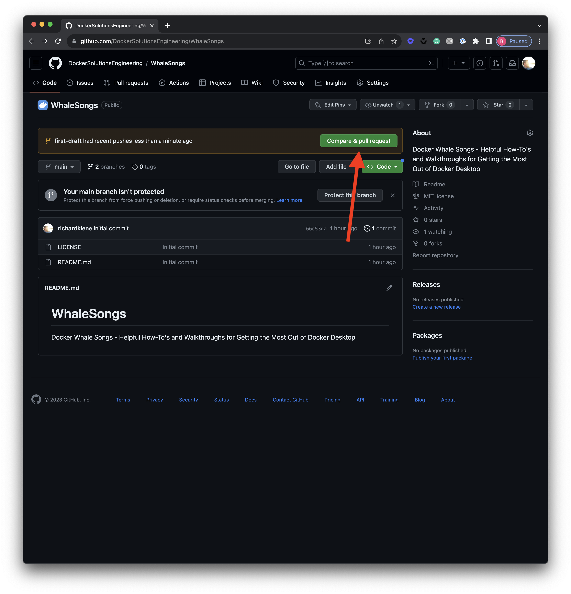

# DockerSongs Walkthroughs

Please use the [table of contents](../README.md) located at the root if you wish to navigate Walkthroughs

## Creating a Walkthrough

#### Step 1: Clone the WhaleSongs repository or pull it:
```shell
# Clone
$ git clone git@github.com:DockerSolutionsEngineering/WhaleSongs.git

# Pull
$ git checkout main
$ git pull --rebase origin main
```
#### Step 2: Create a feature branch
```shell
$ git checkout -b NameOfYourWalkthrough
```
#### Step 3: Create a new directory for your Walkthrough and copy the contents of the Example folder to it:
```shell
$ cd ./WhaleSongs/Walkthroughs
$ mkdir NameOfYourWalkthrough
$ cp -R ./Example/. ../NameOfYourWalkthrough/.
```
#### Step 4: Open the root of the repository in the editor of your choice:
```shell
$ cd ..
$ ${your editor} .
```

#### Step 5: Add your Walkthrough to the [table of contents](../README.md) in alphabetical order and with a relative link:

```
* [Walkthroughs](./Walkthroughs/)
   - [Enable Remote Logging with Splunk](/Walkthroughs/EnableRemoteLoggingWithSplunk/)
   - [Enabling Virtulization Framework on macOS](/Walkthroughs/EnablingVirtualizationOnMacOS/)
   - [Monitoring Docker Desktop with Grafana](./Walkthroughs/MonitoringWithGrafana/)
   - [Understanding Docker Logs](/Walkthroughs/UnderstandingDockerLogs/)
   - [Understanding Where Scout Sends Data](/Walkthroughs/ScoutDataTransmission/)
+  - [Title of Your Walkthrough](/Walkthroughs/NameOfYourWalkthrough/)
```

#### Step 6: Edit the README.md in your folder and follow the outline provided

#### Step 7: Push your feature branch and open a pull request
```shell
$ git add .
$ git commit -am "Add NameOfYourWalkthrough Walkthrough"
$ git push origin NameOfYourWalkthrough
```


