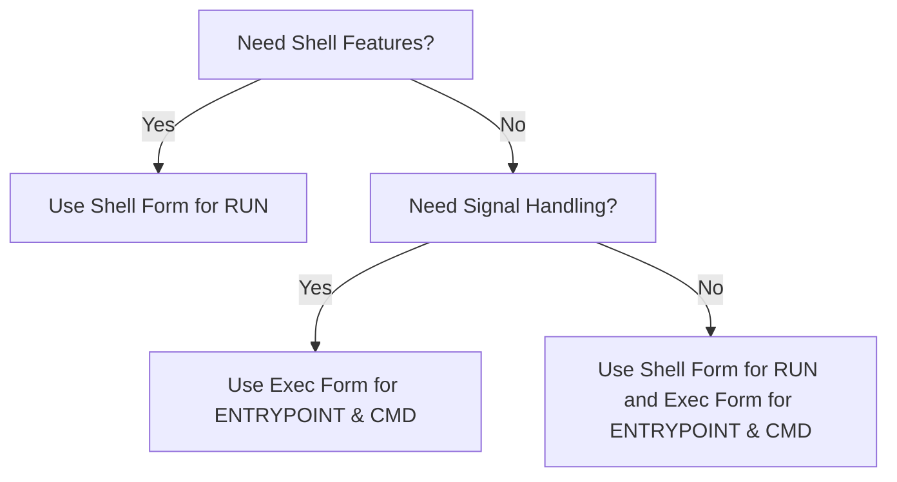
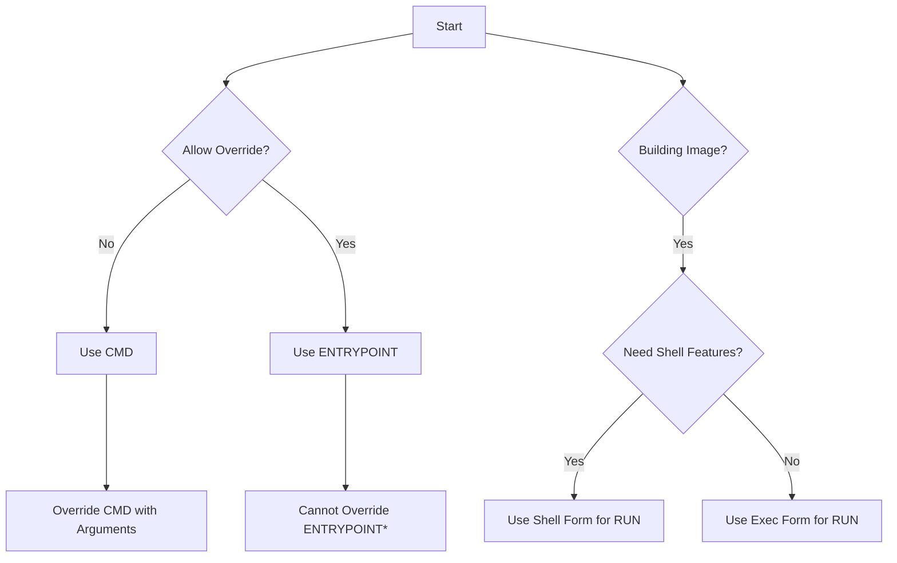

# RUN, CMD, ENTRYPOINT - What to Use Where?
### This walkthrough is intended to provide some guidance around determining the best command and the best format

## Overview 
Docker has three commands that can be used to run executables, and it sometimes is difficult to choose which one to use
for a given situation. Additionally, there are two separate formats that can be used to pass commands and arguments 
into these commands.

### Summary

The following tables and diagrams summarize the key differences and similarities between the commands and format, 
and provides a decision flow to help you decide.

#### Command Description and Use Cases

| Command                                                                      | Description | Use Case |
|------------------------------------------------------------------------------| --- | --- |
| [`CMD`](https://docs.docker.com/engine/reference/builder/#cmd)               | Defines the default executable of a Docker image. Can be overridden by `docker run` arguments. | General-purpose images where users can pass different executables and arguments on the command-line. |
| [`ENTRYPOINT`](https://docs.docker.com/engine/reference/builder/#entrypoint) | Defines the default executable. Cannot be overridden by `docker run` arguments. | Images built for a specific purpose where overriding the default executable is not desired. |
| [`RUN`](https://docs.docker.com/engine/reference/builder/#run)               | Executes commands to build layers. | Building an Image |

#### Format Description and Examples

| Format | Description | Example |
| --- | --- | --- |
| Shell Form | Takes the format of `<INSTRUCTION> <COMMAND>`. | `CMD echo TEST` or `ENTRYPOINT echo TEST` |
| Exec Form | Takes the format of `<INSTRUCTION> ["EXECUTABLE", "PARAMETER"]`. | `CMD ["echo", "TEST"]` or `ENTRYPOINT ["echo", "TEST"]` |

#### Format Use Cases

|     | Shell Form | Exec Form |
| --- | --- | --- |
| **Format** | Commands without `[]` brackets. Run by the container's shell, e.g., `/bin/sh -c`. | Commands with `[]` brackets. Run directly, not through a shell. |
| **Variable Substitution** | Inherits environment variables from the shell, such as `$HOME` and `$PATH`. | Does not inherit shell environment variables but behaves the same for `ENV` instruction variables. |
| **Shell Features** | Supports sub-commands, piping output, chaining commands, I/O redirection, etc. | Does not support shell features. |
| **Signal Trapping & Forwarding** | Most shells do not forward process signals to child processes. | Directly traps and forwards signals like SIGINT. |
| **Usage with ENTRYPOINT** | Can cause issues with signal forwarding. | Recommended due to better signal handling. |
| **CMD as ENTRYPOINT Parameters** | Not possible with the shell form. | If the first item in the array isn't a command, all items are used as parameters for the `ENTRYPOINT`. |

#### Decision Flow: Shell vs Exec



#### Decision Flow for RUN/CMD/ENTRYPOINT



### Example

The following will walk you through the high level differences between `CMD` and `ENTRYPOINT`; in these examples the 
`RUN` command is not included given that the only decision to make there is easily handled by a review of the two 
different formats.

### Test Dockerfile

```
# Use syntax version 1.3-labs for Dockerfile
# syntax=docker/dockerfile:1.3-labs

# Use the Ubuntu 20.04 image as the base image
FROM ubuntu:20.04

# Run the following commands inside the container:
# 1. Update the package lists for upgrades and new package installations
# 2. Install the apache2-utils package (which includes the 'ab' tool)
# 3. Remove the package lists to reduce the image size
#
# This is all run in a HEREDOC; see
# https://www.docker.com/blog/introduction-to-heredocs-in-dockerfiles/
# for more details.
#
RUN <<EOF
apt-get update;
apt-get install -y apache2-utils;
rm -rf /var/lib/apt/lists/*;
EOF

# Set the default command
CMD ab
```

### First Build

We will build this image and tag it as `ab`.

```shell
$ docker build -t ab .

[+] Building 7.0s (6/6) FINISHED                                                               docker:desktop-linux
 => [internal] load .dockerignore                                                                              0.0s
 => => transferring context: 2B                                                                                0.0s
 => [internal] load build definition from Dockerfile                                                           0.0s
 => => transferring dockerfile: 730B                                                                           0.0s
 => [internal] load metadata for docker.io/library/ubuntu:20.04                                                0.4s
 => CACHED [1/2] FROM docker.io/library/ubuntu:20.04@sha256:33a5cc25d22c45900796a1aca487ad7a7cb09f09ea00b779e  0.0s
 => [2/2] RUN <<EOF (apt-get update;...)                                                                       6.5s
 => exporting to image                                                                                         0.0s
 => => exporting layers                                                                                        0.0s
 => => writing image sha256:99ca34fac6a38b79aefd859540f88e309ca759aad0d7ad066c4931356881e518                   0.0s
 => => naming to docker.io/library/ab  
```

### Run With `CMD ab`

Without any arguments, we get a usage block as expected.

```shell
$ docker run ab
ab: wrong number of arguments
Usage: ab [options] [http[s]://]hostname[:port]/path
Options are:
    -n requests     Number of requests to perform
    -c concurrency  Number of multiple requests to make at a time
    -t timelimit    Seconds to max. to spend on benchmarking
                    This implies -n 50000
    -s timeout      Seconds to max. wait for each response
                    Default is 30 seconds
<-- SNIP -->
```

However, if I run ab and include a URL to test I initially get an error:

```shell
$ docker run --rm ab https://jayschmidt.us
docker: Error response from daemon: failed to create task for container: failed to create shim task: OCI runtime create failed: runc create failed: unable to start container process: exec: "https://jayschmidt.us": stat https://jayschmidt.us: no such file or directory: unknown.
```

The issue here is that the string supplied on the command line - `https://jayschmidt.us` - is overriding the `CMD` 
instruction, and that is not a valid command so an error is thrown. So we need to specify the command to run:

```shell
$ docker run --rm  ab ab https://jayschmidt.us/
This is ApacheBench, Version 2.3 <$Revision: 1843412 $>
Copyright 1996 Adam Twiss, Zeus Technology Ltd, http://www.zeustech.net/
Licensed to The Apache Software Foundation, http://www.apache.org/

Benchmarking jayschmidt.us (be patient).....done


Server Software:        nginx
Server Hostname:        jayschmidt.us
Server Port:            443
SSL/TLS Protocol:       TLSv1.2,ECDHE-ECDSA-AES256-GCM-SHA384,256,256
Server Temp Key:        X25519 253 bits
TLS Server Name:        jayschmidt.us

Document Path:          /
Document Length:        12992 bytes

Concurrency Level:      1
Time taken for tests:   0.132 seconds
Complete requests:      1
Failed requests:        0
Total transferred:      13236 bytes
HTML transferred:       12992 bytes
Requests per second:    7.56 [#/sec] (mean)
Time per request:       132.270 [ms] (mean)
Time per request:       132.270 [ms] (mean, across all concurrent requests)
Transfer rate:          97.72 [Kbytes/sec] received

Connection Times (ms)
              min  mean[+/-sd] median   max
Connect:       90   90   0.0     90      90
Processing:    43   43   0.0     43      43
Waiting:       43   43   0.0     43      43
Total:        132  132   0.0    132     132
```

### Run with `ENTRYPOINT`

In this run, we remove the `CMD ab` instruction from the Dockerfile and replace it with `ENTRYPOINT ["ab"]`, and then 
rebuild the image.

This is similar to but different than the `CMD` command - when you use `ENTRYPOINT` you cannot override the command. 
Instead, any arguments passed to the `docker run` command are treated as arguments to the `ENTRYPOINT`.

```shell
$ docker run --rm  ab "https://jayschmidt.us/"
This is ApacheBench, Version 2.3 <$Revision: 1843412 $>
Copyright 1996 Adam Twiss, Zeus Technology Ltd, http://www.zeustech.net/
Licensed to The Apache Software Foundation, http://www.apache.org/

Benchmarking jayschmidt.us (be patient).....done


Server Software:        nginx
Server Hostname:        jayschmidt.us
Server Port:            443
SSL/TLS Protocol:       TLSv1.2,ECDHE-ECDSA-AES256-GCM-SHA384,256,256
Server Temp Key:        X25519 253 bits
TLS Server Name:        jayschmidt.us

Document Path:          /
Document Length:        12992 bytes

Concurrency Level:      1
Time taken for tests:   0.122 seconds
Complete requests:      1
Failed requests:        0
Total transferred:      13236 bytes
HTML transferred:       12992 bytes
Requests per second:    8.22 [#/sec] (mean)
Time per request:       121.709 [ms] (mean)
Time per request:       121.709 [ms] (mean, across all concurrent requests)
Transfer rate:          106.20 [Kbytes/sec] received

Connection Times (ms)
              min  mean[+/-sd] median   max
Connect:       91   91   0.0     91      91
Processing:    31   31   0.0     31      31
Waiting:       31   31   0.0     31      31
Total:        122  122   0.0    122     122
```

### What About Syntax?

In the example above, we use the syntax `ENTRYPOINT ["ab"]` where we wrap the command we want to run in square brackets 
and quotes. However, it is possible to specify `ENTRYPOINT ab` (without quotes or brackets). Let's see what happens 
when we try that.

```shell
$ docker run --rm  ab "https://jayschmidt.us/"
ab: wrong number of arguments
Usage: ab [options] [http[s]://]hostname[:port]/path
Options are:
    -n requests     Number of requests to perform
    -c concurrency  Number of multiple requests to make at a time
    -t timelimit    Seconds to max. to spend on benchmarking
                    This implies -n 50000
    -s timeout      Seconds to max. wait for each response
                    Default is 30 seconds
<-- SNIP -->
```

Your first thought will likely be to re-run the `docker run` command as we did for `CMD ab` above, that is giving both 
the executable and the argument:

```shell
$ docker run --rm ab ab "https://jayschmidt.us/"
ab: wrong number of arguments
Usage: ab [options] [http[s]://]hostname[:port]/path
Options are:
    -n requests     Number of requests to perform
    -c concurrency  Number of multiple requests to make at a time
    -t timelimit    Seconds to max. to spend on benchmarking
                    This implies -n 50000
    -s timeout      Seconds to max. wait for each response
                    Default is 30 seconds
<-- SNIP -->
```

This is because the `ENTRYPOINT` cannot be overridden in the same way that `CMD` is; the takeaway is to always use 
`ENTRYPOINT` when you want to force the usage of a given executable in the container when it is run.


## Citations and Helpful Information
* [`CMD`](https://docs.docker.com/engine/reference/builder/#cmd)               
* [`ENTRYPOINT`](https://docs.docker.com/engine/reference/builder/#entrypoint)
* [`RUN`](https://docs.docker.com/engine/reference/builder/#run)   
