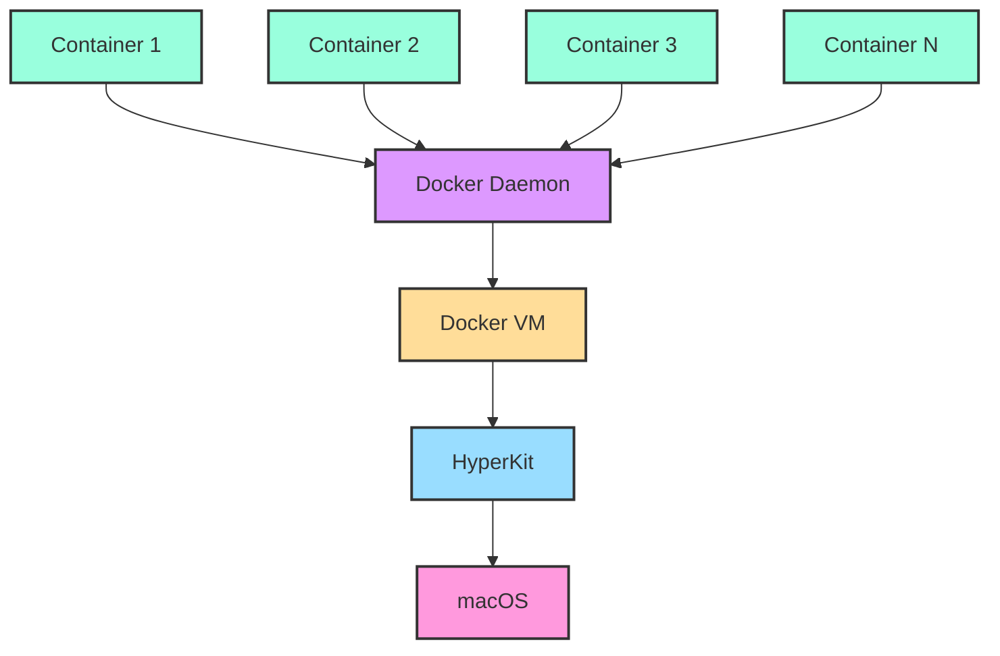

# Understanding the USER Command
### This walkthrough examines the USER command, provides best practices, and demonstrates how it works on a host

## Overview 
The `USER` and `GROUP` commands in Docker are used to execute commands inside a container as a non-root user. If no `USER` or `GROUP` is provided, the container runs as root. This document provides some best practices and things to avoid, and ends with a guided demo for the user to walk through the use of USER/GROUP to better explain the rationale behind the tips given.

### Best Practices

1. **Use a Non-root User**: 
    - For security reasons, it's recommended to run processes inside a container as a non-root user. If an attacker manages to break out of the application running in the container, they will have limited permissions if the container is running as a non-root user.

2. **Specify User by UID and GID**:
    - Instead of specifying a user by name, use the user's UID and GID. This ensures that the user is consistently identified, even if the container's `/etc/passwd` file changes or is different across distributions.
      ```Dockerfile
      USER 1001:1001
      ```

3. **Create a Specific User for the Application**:
    - If your application requires specific permissions, consider creating a dedicated user for your application in the Dockerfile. This can be done using the `RUN` command to add the user.
      ```Dockerfile
      RUN useradd -ms /bin/bash myuser
      USER myuser
      ```

4. **Switch Back to Root for Privileged Operations**:
    - If you need to perform privileged operations in the Dockerfile after setting a non-root user, you can switch back to the root user and then switch back to the non-root user once those operations are complete.
      ```Dockerfile
      USER root
      RUN apt-get update && apt-get install -y some-package
      USER myuser
      ```

5. **Combine USER with WORKDIR**:
    - If you're setting a non-root user, ensure that the working directory (`WORKDIR`) is writable by that user. This avoids potential permission issues.

### Things to Avoid

1. **Avoid Using Root User**:
    - As mentioned, avoid running containers as the root user unless absolutely necessary. This minimizes the potential damage if the container is compromised.

2. **Avoid Hardcoding User Names**:
    - User names might not be consistent across different base images or distributions. Instead, use UIDs and GIDs.

3. **Avoid Ignoring File Permissions**:
    - When switching to a non-root user, ensure that any files or directories that the application needs to access are accessible by that user. This includes both read and write permissions as necessary.

4. **Avoid Not Setting a USER**:
    - If you don't set a `USER` in your Dockerfile, the user will default to root. Always explicitly set a user, even if it's just to make it clear who the container will run as.

5. **Avoid Setting a User Without Necessary Privileges**:
    - Ensure that the user you set has the necessary privileges to run the commands in the container. For instance, a non-root user might not have the necessary permissions to bind to ports below 1024.

### Examples
The following examples walk you through a series of examples to show this in action. We will use two Dockerfiles, with one setting the UID/GID directly and one using the default:

#### Dockerfile1
```dockerfile
# Use the official Ubuntu image as the base
FROM ubuntu:20.04

# Print the UID and GID
CMD sh -c "echo 'Inside Container:' && echo 'User: $(whoami) UID: $(id -u) GID: $(id -g)'"
```

#### Dockerfile2
```dockerfile
# Use the official Ubuntu image as the base
FROM ubuntu:20.04

# Create a custom user with UID 1234 and GID 1234
RUN groupadd -g 1234 customgroup && \
    useradd -m -u 1234 -g customgroup customuser

# Switch to the custom user
USER customuser

# Print the UID and GID
CMD sh -c "echo 'Inside Container:' && echo 'User: $(whoami) UID: $(id -u) GID: $(id -g)'"
```

#### Build the Images
```shell
$ docker build -t default-user-image -f Dockerfile1 .

[+] Building 0.5s (5/5) FINISHED                                                               docker:desktop-linux
 => [internal] load build definition from Dockerfile1                                                          0.0s
 => => transferring dockerfile: 255B                                                                           0.0s
 => [internal] load .dockerignore                                                                              0.0s
 => => transferring context: 2B                                                                                0.0s
 => [internal] load metadata for docker.io/library/ubuntu:20.04                                                0.4s
 => CACHED [1/1] FROM docker.io/library/ubuntu:20.04@sha256:33a5cc25d22c45900796a1aca487ad7a7cb09f09ea00b779e  0.0s
 => exporting to image                                                                                         0.0s
 => => exporting layers                                                                                        0.0s
 => => writing image sha256:d4f5578181af02f83867694b1f002c742d41187d798ee15258babe513f3ab0fd                   0.0s
 => => naming to docker.io/library/default-user-image                                                          0.0s

View build details: docker-desktop://dashboard/build/desktop-linux/desktop-linux/emarqc9x7zz6qn5zamdx1umo8

What's Next?
  View a summary of image vulnerabilities and recommendations → docker scout quickview
```

```shell
$ docker build -t custom-user-image -f Dockerfile2 .

[+] Building 0.5s (6/6) FINISHED                                                               docker:desktop-linux
 => [internal] load .dockerignore                                                                              0.0s
 => => transferring context: 2B                                                                                0.0s
 => [internal] load build definition from Dockerfile2                                                          0.0s
 => => transferring dockerfile: 438B                                                                           0.0s
 => [internal] load metadata for docker.io/library/ubuntu:20.04                                                0.4s
 => [1/2] FROM docker.io/library/ubuntu:20.04@sha256:33a5cc25d22c45900796a1aca487ad7a7cb09f09ea00b779e3b2026b  0.0s
 => CACHED [2/2] RUN groupadd -g 1234 customgroup &&     useradd -m -u 1234 -g customgroup customuser          0.0s
 => exporting to image                                                                                         0.0s
 => => exporting layers                                                                                        0.0s
 => => writing image sha256:312632c54afc34dac90543afefa6f15b3c70244ddf8c0038954b9256742919ba                   0.0s
 => => naming to docker.io/library/custom-user-image                                                           0.0s

View build details: docker-desktop://dashboard/build/desktop-linux/desktop-linux/pr185jmyxf0amy0ukfsq75znm

What's Next?
  View a summary of image vulnerabilities and recommendations → docker scout quickview
```

### Test!

#### Who Am I?
First we will pull our current UID/GID from the system using the `id` command. I'm UID 503 with a primary GID of 20:

```shell
$ id
uid=503(jschmidt) gid=20(staff) groups=20(staff),12(everyone),61(localaccounts),79(_appserverusr),80(admin),81(_appserveradm),98(_lpadmin),702(com.apple.sharepoint.group.2),701(com.apple.sharepoint.group.1),33(_appstore),100(_lpoperator),204(_developer),250(_analyticsusers),395(com.apple.access_ftp),398(com.apple.access_screensharing),399(com.apple.access_ssh),400(com.apple.access_remote_ae)
```

#### Default Docker Image
Let's run our first image, the one that does not provide a `USER` command. As you can see, the UID and GID are 0/0, so the superuser (root). There are two things at work here; first, we are not defining a UID/GID in the Dockerfile so Docker defaults to the superuser. But how does it become superuser if my account is not a superuser account? This is because the Docker engine runs with root permissions, so containers that are built to run as root inherit the permissions from the Docker engine.

```shell
$ docker run --rm default-user-image
Inside Container:
User: root UID: 0 GID: 0
```

#### Custom User Docker Image
Let's try and fix this - we really don't want containers running as root. So in this version we explicitly set the UID and GID for the User and Group. Running this container, we see that our user is set appropriately.

```shell
$ docker run --rm custom-user-image
Inside Container:
User: customuser UID: 1234 GID: 1234
```

#### What About user 1234 on the Host?
We used a UID and GID that we made up for this container, but does that exist on the host and if not does it matter? A check of the host shows that the UID 1234 does not exist, so we do not have to match on the host.
```shell
$ id 1234
id: 1234: no such user
```

#### Ummm, What About the VM?
At this point, users of Docker Desktop will notice the flaw in my approach here. I'm interacting directly with the host OS, but for users of Docker Desktop the containers are actually being run in a VM! So, I need to get into that VM to validate all of my findings above. 

We will use the `nsenter` utility image to enter the VM using the following command, which will give us an interactive shell. Note that there are security implications around being able to do this; Docker's [Hardened Docker Desktop](https://docs.docker.com/desktop/hardened-desktop/) and [Enhanced Container Isolation](https://docs.docker.com/desktop/hardened-desktop/enhanced-container-isolation/) can be used to mitigate this risk on developer system. Since this is a demo, we are running Docker without any security precautions.

```shell
$ docker run -it --rm --privileged --pid=host justincormack/nsenter1
# id 1234
id: unknown user 1234
```

So we can see from the above that user 1234 does not exist in the Docker VM. The VM runs as it's own process via Apple's Hyperkit:

```shell
$ ps -ef | grep com.docker.virtualization
  503 70764 44911   0 Thu04PM ??         0:00.89 /Applications/Docker.app/Contents/MacOS/com.docker.virtualization --kernel /Applications/Docker.app/Contents/Resources/linuxkit/kernel --cmdline vsyscall=emulate panic=1 nospec_store_bypass_disable noibrs noibpb no_stf_barrier mitigations=off linuxkit.unified_cgroup_hierarchy=1 console=hvc0  irqaffinity=0 virtio_net.disable_csum=1 eth0.IPNet=192.168.65.3/24 eth0.router=192.168.65.1 eth1.dhcp vpnkit.connect=connect://2/1999 vpnkit.disable=osxfs-data --ramdisk /Applications/Docker.app/Contents/Resources/linuxkit/initrd.img --disk /Users/jschmidt/Library/Containers/com.docker.docker/Data/vms/0/data/Docker.raw --networkType gvisor --macaddr-filename-prefix vms/0/macaddr --cpus 13 --memoryMiB 8092 --console-log log/vm/console.log --console /Users/jschmidt/Library/Containers/com.docker.docker/Data/vms/0/console.sock --api /Users/jschmidt/Library/Containers/com.docker.docker/Data/virtualization.sock --watchdog --kernel-for-udp --virtiofs /Users --virtiofs /Volumes --virtiofs /private --virtiofs /tmp --virtiofs /var/folders --rosetta
  503 65010  3992   0 12:28PM ttys000    0:00.00 grep com.docker.virtualization
```

#### Diagram

The diagram below provides a very high level and simplified view of the relationship between the Docker components in a Macintosh deployment.

