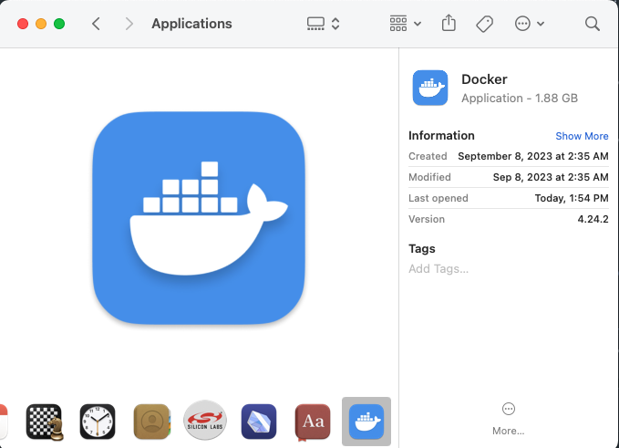
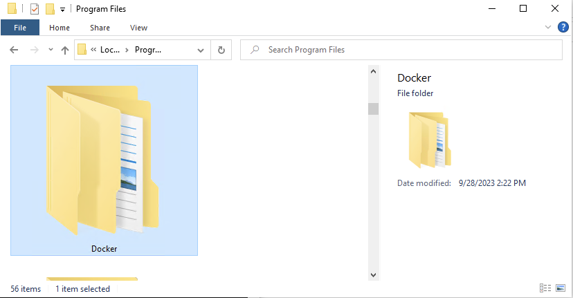

# Which Docker am I Using?
### This walkthrough explains some of the ways to determine if you are using Docker Desktop.

### Notes 
* It is possible to install both the [Docker Engine](https://docs.docker.com/engine/) (community installation) and 
  [Docker Desktop](https://docs.docker.com/desktop/) (licensed software installation) on the same system.
* The `docker` command may be aliased in order to use a non-docker build/runtime system; be sure to check for an
alias as part of your testing.
  * On both Linux and Macintosh, the command `alias docker` will show if the command is aliased.
  * On both Linux and Macintosh, you can also check for symlinks from `docker` to other commands by running
   `ls -alt $(which docker)`.

The following information will help you determine which version of Docker you are running, but please be sure to check for both installations.

## Key Differences
### Docker Engine 
* Components: [Docker Engine](https://docs.docker.com/engine/) includes the Docker daemon (dockerd) and the Docker CLI 
  (docker). It does not come with additional tooling like Docker Compose, which needs to be installed separately.
* No GUI: Docker CE is a command-line tool and does not come with a graphical user interface. All interactions are done via the command line.
* Direct Run: Docker CE runs on the OS without an isolated VM (although the user can build this isolation layer if desired).

### Docker Desktop
* Components: [Docker Desktop](https://docs.docker.com/desktop/) includes all of the currently shipping tooling, such 
 as [Docker Compose](https://docs.docker.com/compose), [Docker Scout](https://docs.docker.com/scout), etc.
* GUI and CLI: Docker Desktop comes with both a CLI and a graphical user interface (GUI) that allows users to manage containers, images, and other Docker resources.
* Virtual Machine: Docker Desktop uses a VM to contain all of the containers that the user runs. The virtualization technology employed depends on the OS being used.
	* Mac: Hyperkit or qemu
	* Windows: Hyper-V or WSL2
	* Linux: qemu

# Check For an Installation
The easiest way to check for Docker Desktop is to look for the installation; this can be automated by scripting or the use of an MDM solution.

Please note that the following assume that Docker Desktop is installed in the default location, which may result in false negatives if other installation paths are used.

## Macintosh
On the Macintosh, the [Docker Desktop](https://docs.docker.com/desktop/install/mac-install/)
application is installed under the `/Applications` directory and is named `Docker`.

```shell
$ ls -alt /Applications/Docker.app/
total 0
drwxrwxr-x  49 root      admin  1568 Oct 13 09:54 ..
drwxr-xr-x@  9 jschmidt  admin   288 Sep 28 15:36 Contents
drwxr-xr-x@  3 jschmidt  admin    96 Sep  8 02:35 .
```




## Windows
On Windows, the [Docker Desktop](https://docs.docker.com/desktop/install/windows-install/)
application is installed under the `C:\Program Files` folder and is named `Docker`



```shell
C:\Users\qdzlug>dir "c:\Program Files\Docker"
 Volume in drive C has no label.
 Volume Serial Number is DEFE-FC15

 Directory of c:\Program Files\Docker

09/28/2023  02:22 PM    <DIR>          .
09/28/2023  02:22 PM    <DIR>          ..
09/28/2023  02:22 PM    <DIR>          cli-plugins
09/28/2023  02:21 PM    <DIR>          Docker
               0 File(s)              0 bytes
               4 Dir(s)  52,964,356,096 bytes free

C:\Users\qdzlug>
```

## Linux
On Linux, the [Docker Desktop](https://docs.docker.com/desktop/install/linux-install/)
application is installed under `/opt/docker-desktop`

```shell
$ ls -lat /opt/docker-desktop/
total 208528
drwxr-xr-x 7 root root      4096 Sep 29 10:58  .
drwxr-xr-x 2 root root      4096 Sep 29 10:58  locales
drwxr-xr-x 5 root root      4096 Sep 29 10:58  resources
drwxr-xr-x 2 root root      4096 Sep 29 10:58  share
drwxr-xr-x 2 root root      4096 Sep 29 10:58  linuxkit
drwxr-xr-x 2 root root      4096 Sep 29 10:58  bin
drwxr-xr-x 7 root root      4096 Sep 29 10:57  ..
-rw-r--r-- 1 root root   5313018 Sep 27 12:10  resources.pak
-rw-r--r-- 1 root root    273328 Sep 27 12:10  snapshot_blob.bin
-rw-r--r-- 1 root root    588152 Sep 27 12:10  v8_context_snapshot.bin
-rw-r--r-- 1 root root       107 Sep 27 12:10  vk_swiftshader_icd.json
-rw-r--r-- 1 root root    127746 Sep 27 12:10  chrome_100_percent.pak
-rw-r--r-- 1 root root    179160 Sep 27 12:10  chrome_200_percent.pak
-rwxr-xr-x 1 root root   1254728 Sep 27 12:10  chrome_crashpad_handler
-rwxr-xr-x 1 root root     54256 Sep 27 12:10  chrome-sandbox
-rw-r--r-- 1 root root       398 Sep 27 12:10  componentsVersion.json
-rwxr-xr-x 1 root root 166000248 Sep 27 12:10 'Docker Desktop'
-rw-r--r-- 1 root root  10544880 Sep 27 12:10  icudtl.dat
-rwxr-xr-x 1 root root    252920 Sep 27 12:10  libEGL.so
-rwxr-xr-x 1 root root   2877248 Sep 27 12:10  libffmpeg.so
-rwxr-xr-x 1 root root   6633192 Sep 27 12:10  libGLESv2.so
-rwxr-xr-x 1 root root   4623704 Sep 27 12:10  libvk_swiftshader.so
-rwxr-xr-x 1 root root   6402632 Sep 27 12:10  libvulkan.so.1
-rw-r--r-- 1 root root      1096 Sep 27 12:10  LICENSE.electron.txt
-rw-r--r-- 1 root root   8328249 Sep 27 12:10  LICENSES.chromium.html
```


Note - the launch icon / location for Docker will depend on the distribution being used.

# Check a Running Installation
It is also possible to check a running installation to determine which version of Docker is being used. 

To do this, you need to use the [`docker version`](https://docs.docker.com/engine/reference/commandline/version/)
command; the "Server" line will indicate the version being used. 


### Docker Desktop on Macintosh arm64
The **Server: Docker Desktop 4.24.0 (122432)** line indicates the use of Docker Desktop
```shell
$ docker version
Client:
 Cloud integration: v1.0.35+desktop.5
 Version:           24.0.6
 API version:       1.43
 Go version:        go1.20.7
 Git commit:        ed223bc
 Built:             Mon Sep  4 12:28:49 2023
 OS/Arch:           darwin/arm64
 Context:           default

**Server: Docker Desktop 4.24.0 (122432)**
 Engine:
  Version:          24.0.6
  API version:      1.43 (minimum version 1.12)
  Go version:       go1.20.7
  Git commit:       1a79695
  Built:            Mon Sep  4 12:31:36 2023
  OS/Arch:          linux/arm64
  Experimental:     true
 containerd:
  Version:          1.6.22
  GitCommit:        8165feabfdfe38c65b599c4993d227328c231fca
 runc:
  Version:          1.1.8
  GitCommit:        v1.1.8-0-g82f18fe
 docker-init:
  Version:          0.19.0
  GitCommit:        de40ad0
```


### Docker Desktop on Windows
The **Server: Docker Desktop 4.24.0 (122432)** line indicates the use of Docker Desktop
```shell
C:\Users\qdzlug>docker version
Client:
 Cloud integration: v1.0.35+desktop.5
 Version:           24.0.6
 API version:       1.43
 Go version:        go1.20.7
 Git commit:        ed223bc
 Built:             Mon Sep  4 12:32:48 2023
 OS/Arch:           windows/amd64
 Context:           default

**Server: Docker Desktop 4.24.0 (122432)**
 Engine:
  Version:          dev
  API version:      1.44 (minimum version 1.12)
  Go version:       go1.20.8
  Git commit:       HEAD
  Built:            Tue Sep 26 11:52:32 2023
  OS/Arch:          linux/amd64
  Experimental:     false
 containerd:
  Version:          1.6.22
  GitCommit:        8165feabfdfe38c65b599c4993d227328c231fca
 runc:
  Version:          1.1.8
  GitCommit:        v1.1.8-0-g82f18fe
 docker-init:
  Version:          0.19.0
  GitCommit:        de40ad0

C:\Users\qdzlug>
```

### Docker Desktop on Linux
```shell
C:\Users\qdzlug>docker info
Client:
 Version:    24.0.6
 Context:    default
 Debug Mode: false
 Plugins:
  buildx: Docker Buildx (Docker Inc.)
    Version:  v0.11.2-desktop.5
    Path:     C:\Program Files\Docker\cli-plugins\docker-buildx.exe
  compose: Docker Compose (Docker Inc.)
    Version:  v2.2.3
    Path:     C:\Users\qdzlug\.docker\cli-plugins\docker-compose.exe
  dev: Docker Dev Environments (Docker Inc.)
    Version:  v0.1.0
    Path:     C:\Program Files\Docker\cli-plugins\docker-dev.exe
  extension: Manages Docker extensions (Docker Inc.)
```

### Docker Community on Linux
The **Server: Docker Engine - Community** line indicates they are using the community edition.
```shell
$ docker version
Client: Docker Engine - Community
 Cloud integration: v1.0.35+desktop.5
 Version:           24.0.6
 API version:       1.43
 Go version:        go1.20.7
 Git commit:        ed223bc
 Built:             Mon Sep  4 12:31:44 2023
 OS/Arch:           linux/amd64
 Context:           default

**Server: Docker Engine - Community**
 Engine:
  Version:          24.0.6
  API version:      1.43 (minimum version 1.12)
  Go version:       go1.20.7
  Git commit:       1a79695
  Built:            Mon Sep  4 12:31:44 2023
  OS/Arch:          linux/amd64
  Experimental:     true
 containerd:
  Version:          1.6.24
  GitCommit:        61f9fd88f79f081d64d6fa3bb1a0dc71ec870523
 runc:
  Version:          1.1.9
  GitCommit:        v1.1.9-0-gccaecfc
 docker-init:
  Version:          0.19.0
  GitCommit:        de40ad0
 ```
 
## Docker Contexts
It is important to note that multiple contexts can be installed on a system; this is most often seen in Linux where Docker Desktop and Community are installed on the same host. To switch between the two, the `docker context use` command is used. When you are in a context you communicate with the daemon for that context - so in a dual installation case you would be switching between the Docker Desktop install and the host install.

To view contexts you use `docker context ls`; then you switch via `docker context use CONTEXTNAME`. The following example shows a Linux system with both installed.

```shell
$ docker context ls
NAME                TYPE                DESCRIPTION                               DOCKER ENDPOINT                                     KUBERNETES ENDPOINT   ORCHESTRATOR
default *           moby                Current DOCKER_HOST based configuration   unix:///var/run/docker.sock                                     
desktop-linux       moby                Docker Desktop                            unix:///home/jschmidt/.docker/desktop/docker.sock               
$ docker version
Client: Docker Engine - Community
 Cloud integration: v1.0.35+desktop.5
 Version:           24.0.6
 API version:       1.43
 Go version:        go1.20.7
 Git commit:        ed223bc
 Built:             Mon Sep  4 12:31:44 2023
 OS/Arch:           linux/amd64
 Context:           default

Server: Docker Engine - Community
 Engine:
  Version:          24.0.6
  API version:      1.43 (minimum version 1.12)
  Go version:       go1.20.7
  Git commit:       1a79695
  Built:            Mon Sep  4 12:31:44 2023
  OS/Arch:          linux/amd64
  Experimental:     true
 containerd:
  Version:          1.6.24
  GitCommit:        61f9fd88f79f081d64d6fa3bb1a0dc71ec870523
 runc:
  Version:          1.1.9
  GitCommit:        v1.1.9-0-gccaecfc
 docker-init:
  Version:          0.19.0
  GitCommit:        de40ad0
$ docker context use desktop-linux
desktop-linux
Current context is now "desktop-linux"
$ docker version
Client: Docker Engine - Community
 Cloud integration: v1.0.35+desktop.5
 Version:           24.0.6
 API version:       1.43
 Go version:        go1.20.7
 Git commit:        ed223bc
 Built:             Mon Sep  4 12:31:44 2023
 OS/Arch:           linux/amd64
 Context:           desktop-linux

Server: Docker Desktop 4.24.0 (122432)
 Engine:
  Version:          24.0.6
  API version:      1.43 (minimum version 1.12)
  Go version:       go1.20.7
  Git commit:       1a79695
  Built:            Mon Sep  4 12:32:16 2023
  OS/Arch:          linux/amd64
  Experimental:     false
 containerd:
  Version:          1.6.22
  GitCommit:        8165feabfdfe38c65b599c4993d227328c231fca
 runc:
  Version:          1.1.8
  GitCommit:        v1.1.8-0-g82f18fe
 docker-init:
  Version:          0.19.0
  GitCommit:        de40ad0
```

## Citations and Helpful Information
* [Docker Engine](https://docs.docker.com/engine/) 
* [Docker Desktop](https://docs.docker.com/desktop/)
* Docker Desktop [Windows Install](https://docs.docker.com/desktop/install/windows-install/)
* Docker Desktop [Linux Install](https://docs.docker.com/desktop/install/linux-install/)
* Docker Desktop [Macintosh Install](https://docs.docker.com/desktop/install/mac-install/)

